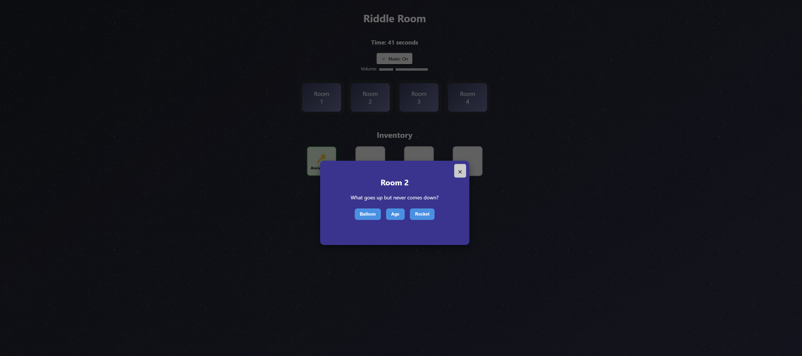

🔒 This project is unlicensed and intended for educational purposes only.

# Mystery of the Four Rooms (Riddle Room Game)

A web-based puzzle where you solve riddles, collect magical items, and escape the mysterious rooms! This game is built with vanilla HTML, CSS, and JavaScript, and features interactive gameplay, sound effects, and a modern, responsive design. This was created as a student project and is something I would like to expand upon. It's very simple in its current state. So, I would currently label it as a "Work in Progress".

---

## 🧩 Game Overview

**Mystery of the Four Rooms** challenges you to solve a series of riddles, each hidden within a different room. Correct answers reward you with magical items. Some rooms require items from previous rooms to unlock. Collect all four items to win!

---

## 🎮 Features

- **Four unique riddle rooms** with increasing challenge
- **Inventory system**: Collect and display magical items as you progress
- **Sound effects**: Audio feedback for correct, incorrect, and win events
- **Background music**: Immersive looping soundtrack with volume and mute controls
- **Timer**: Track how long it takes you to escape
- **Responsive design**: Play on desktop or mobile browsers
- **No dependencies**: Pure HTML, CSS, and JavaScript

---

## 🚀 Getting Started

1. **Clone or Download** this repository.
2. **Open** `index.html` in your web browser.

No build steps or installations required!

---

## 🕹️ How to Play

1. Click **Start Game** on the title screen.
2. Click on a room to attempt its riddle.
3. Select the correct answer from the choices.
4. Collect the magical item for each room you solve.
5. Some rooms require items from previous rooms—explore wisely!
6. Collect all four items to win. Your time will be displayed at the top.
7. Use the music button and volume slider to control background music.

---

## 🔊 Audio Credits

- **bg-Music.mp3**: Background music
- **correct.mp3**: Correct answer sound
- **wrong.mp3**: Incorrect answer sound
- **win.mp3**: Victory sound

---

## ✨ Customization

- Add your own riddles by editing the `riddles` object in `script.js`.
- Replace or add sound effects in the `sounds/` folder and update the audio tags in `index.html` if needed.
- Modify styles in `style.css` for a personalized look.

---

## 🎬 Screenshots

<strong>Main</strong>

<strong>Riddle</strong>

<strong>Victory</strong>

---